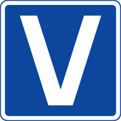

### Hi there, *Wasu* here ;D

<!-- 
## About me:
 - 🎓 Masters of Engineering **Intelligent Control Systems**, AGH University of Science and Technology, Cracow, Poland, 2022
   - 📝 thesis: ***A low-latency test platform using signal processing acceleration in an FPGA***.
 - 🎓 Bachelor of Engineering **Automatics and Robotics**, AGH University of Science and Technology, Cracow, Poland, 2021
   - 📝 thesis: ***Object identification based on the fusion of data from the video stream in the visible light and infrared range using artificial intelligence***.
   In simple terms: Object detection using RGBD (Red-Green-Blue-Depth) video stream. -->

<!-- ## Technology -->
<!-- 
### FPGA
### Python
### C++ -->

<!--  -->

 <!-- ## Projects:
 1. Tutor's Helper *(Mit App Inventor, Android App)*
 2. SmartHome System *(Raspberry Pi 4, ESP, Arduino)*
 3. Stairs led lights controller *(Arduino, C++)*
 4. Object Detection AI aimbot in Counter Strike Global Offensive *(Tensorflow, Python)*
 5. Abandoned Object Detection System *(C++, OpenCV)* - private repo atm, TBA
 6. Inverted Pendulum Controller *(Matlab, Simulink)* - private repo atm, TBA
 7. Other smaller projects: LED Cube 8x8x8, Robots, Air Cooling System and much more.

 ## Languages:

| Verilog 	   | VHDL 	   | Python   | C++      |
|:--------:|:--------:|:--------:|:--------:|
|  |  |  |  |

## Tools:

1. FPGA
   1. Vivado
   2. UVM
   3. ModelSIM
   4. VUnit
   5. Quartus - basics
   6. OSVVM

| VUnit | Pycharm | Visual Studio |  Vivado | Arduino IDE | GIT | Linux |
|:-------:|:-------:|:-------------:|--------|-------------|-----|-------|
|         |         |               |        |             |     |       |

---
### *Me when I am coding in...*
| VHDL        | Python      | C++         |
|:-----------:|:-----------:|:-----------:|
|     	|     	|  	|

--- -->
