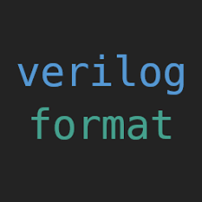

### Hi there, *Wasu* here ;D

## About me:
 - 🎓 **Automatics and Robotics** student at AGH University of Science and Technology, Cracow, Poland
 - 📝 I'm currently working on my thesis: 
 ***Object identification based on the fusion of data from the video stream in the visible light and infrared range using artificial intelligence***
 
 - *Projects*:
 1. Vision Based AI aim bot in Counter Strike Global Offensive *(Tensorflow, Python)*
 2. Open source stairs led lights controller *(Arduino, C++)*
 3. SmartHome System *(Raspberry Pi 4, ESP, Arduino)*
 4. Other small projects
 
 ## Languages:
| C++ 	| Python 	| Verilog 	|
|-----	|--------	|---------	|
|     	|        	|         	|
 
 ## Tools:
 | Pycharm | Visual Studio | Eclipse | Vivado | Arduino IDE | GIT | Linux |
|:-------:|:-------------:|:-------:|--------|-------------|-----|-------|
|         |               |         |        |             |     |       |
